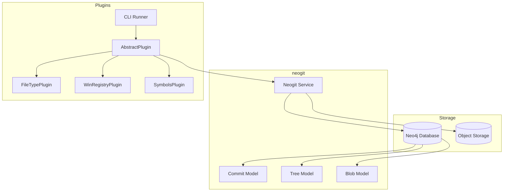
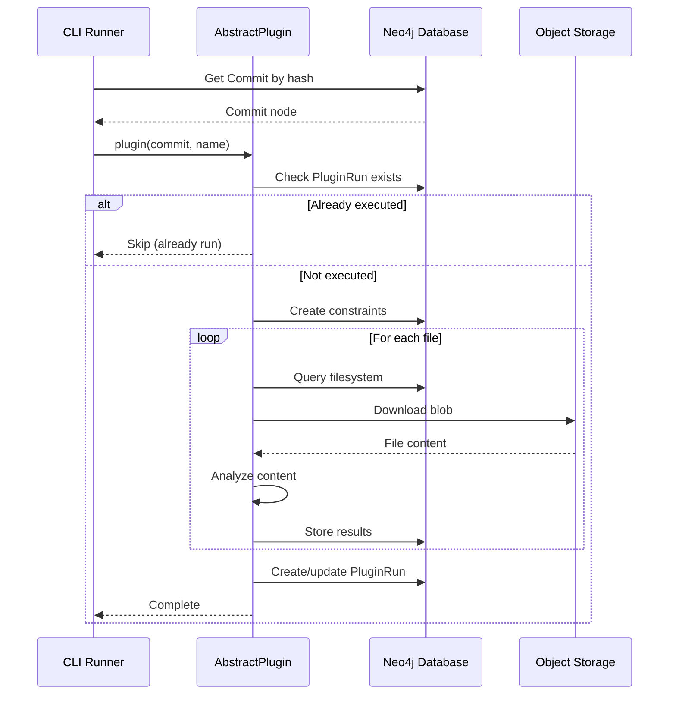
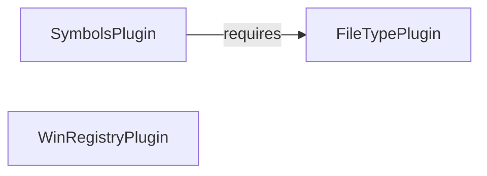

# Architecture

This document explains the overall architecture of GraphEOS Plugins and how its components work together.

## System Overview

GraphEOS Plugins is a framework for analyzing filesystem snapshots stored in a Neo4j graph database. It extends the base data model provided by [neogit](https://github.com/OSWatcher/neogit) with domain-specific analysis results.



## Core Concepts

### Filesystem as a Graph

neogit stores filesystem snapshots as a Merkle tree in Neo4j:

- **Commits** represent points in time
- **Trees** represent directories
- **Blobs** represent file contents

This structure enables:
- Efficient deduplication (identical content shares nodes)
- Version tracking (commits link via `HAS_PREVIOUS`)
- Graph queries across the entire filesystem

### Plugin Extension Model

Plugins extend this base model by:

1. Traversing the filesystem graph
2. Downloading and analyzing file contents
3. Creating new nodes and relationships
4. Attaching results to existing Blob nodes

This keeps the base model clean while allowing rich domain-specific extensions.

## Component Details

### neogit Library

The foundation layer providing:

- **Models**: `Commit`, `Tree`, `Blob`, `PluginRun` (neomodel-based)
- **Neogit Service**: Database connection, object storage access
- **Merkle Utilities**: `MerkleVisitor`, `MerkleNode` for tree processing

Plugins interact with neogit through the `AbstractPlugin.neogit` property.

### AbstractPlugin Base Class

All plugins inherit from `AbstractPlugin`, which provides:

```python
class AbstractPlugin:
    logger      # Pre-configured logger
    neogit      # Database and storage access

    def __call__(commit, plugin_name):
        # Orchestrates execution

    def run(commit):
        # Override in subclass

    def constraints_data():
        # Define unique constraints

    def downloaded_file(hash):
        # Context manager for temp files
```

### Plugin Registry

Plugins are registered in `plugins/plugins/__init__.py`:

```python
class PluginType(Enum):
    FILETYPE = auto()
    SYMBOLS = auto()
    WINREG = auto()

MAP_PLUGIN: Dict[PluginType, Type[AbstractPlugin]] = {
    PluginType.FILETYPE: FileTypePlugin,
    PluginType.SYMBOLS: SymbolsPlugin,
    PluginType.WINREG: WinRegistryPlugin,
}
```

### CLI Runner

The entry point (`plugins/__main__.py`):

1. Parses command-line arguments
2. Loads the target commit from Neo4j
3. Instantiates the requested plugin
4. Executes the plugin

## Execution Flow



## Data Flow

### Input

1. **Commit hash**: Identifies which filesystem snapshot to process
2. **Plugin type**: Determines which analysis to run

### Processing

1. Plugin traverses the filesystem tree
2. Downloads relevant blobs from object storage
3. Analyzes file contents using specialized libraries
4. Constructs result nodes with Merkle hashes

### Output

1. New nodes created (e.g., `MimeType`, `WinRegKey`, `Symbol`)
2. Relationships to source Blobs established
3. `PluginRun` node updated with execution timestamp

## Design Decisions

### Why Merkle Hashing?

Plugins compute Merkle hashes for their output nodes. This enables:

- **Deduplication**: Identical structures share nodes across commits
- **Change detection**: Hash differences indicate content changes
- **Integrity**: Hashes verify data hasn't been corrupted

See [Merkle Pattern](merkle-pattern.md) for details.

### Why Graph Storage?

Neo4j enables powerful queries:

- Find all files of a specific type across versions
- Track registry key changes over time
- Correlate symbols with file metadata

### Why Plugin Architecture?

Separation of concerns:

- Base model stays simple and stable
- Plugins can be added without modifying core
- Each plugin focuses on one analysis domain
- Plugins can depend on each other's results

## Plugin Dependencies



- **FileTypePlugin**: No dependencies
- **WinRegistryPlugin**: No dependencies
- **SymbolsPlugin**: Requires FileTypePlugin (uses MIME type to find PE files)

## Configuration

Plugins use Dynaconf for configuration:

```python
# plugins/config/__init__.py
settings = Dynaconf(
    envvar_prefix="GPLUGINS",
    environments=True,
    load_dotenv=True,
    settings_files=["default_settings.toml"],
)
```

Environment variables with `GPLUGINS_` prefix override defaults.
