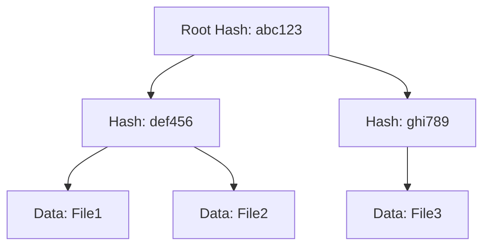
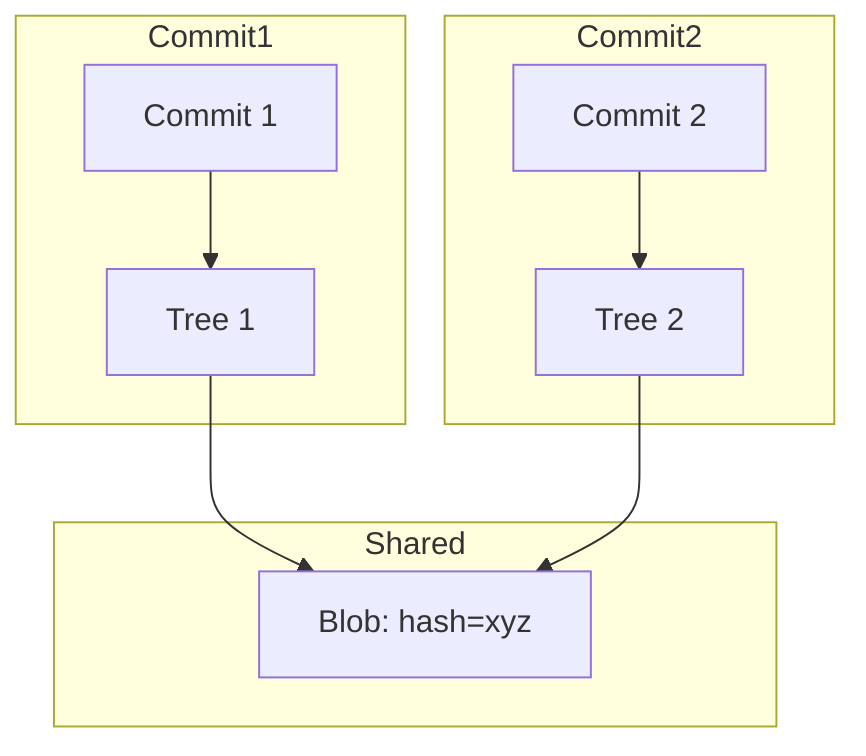
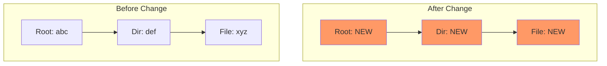

# Merkle Tree Pattern

This document explains the Merkle tree pattern used throughout GraphEOS Plugins for content-addressed storage and deduplication.

## What is a Merkle Tree?

A Merkle tree is a data structure where:

1. **Leaf nodes** contain hashes of actual data
2. **Internal nodes** contain hashes of their children's hashes
3. **Root hash** uniquely identifies the entire tree



## Why Merkle Trees?

### Content Addressing

Instead of using arbitrary IDs, nodes are identified by their content hash:

```python
# Traditional approach
node = Node(id=1, name="SYSTEM", data=...)

# Content-addressed approach
node = Node(hash=sha1(data), data=...)
```

Benefits:
- Same content always produces same hash
- Hash acts as both ID and integrity check
- No need for centralized ID generation

### Automatic Deduplication

When two commits share identical subtrees, they reference the same nodes:



### Change Detection

Hash changes propagate up the tree. If any data changes, all ancestor hashes change:



## Implementation in GraphEOS Plugins

### MerkleNode

Base class for content-addressed nodes:

```python
@define(auto_attribs=True)
class MerkleNode:
    hash: str                           # Content hash
    label: MerkleLabel                  # Blob or Tree
    children: Dict[str, MerkleNode]     # Child nodes (for trees)
```

### MerkleVisitor

Visitor pattern for traversing and hashing trees:

```python
class MerkleVisitor:
    def visit(self, node: Node) -> VisitedNode:
        """Dispatch to type-specific visitor method"""
        method = f"visit_{type(node).__name__}"
        return getattr(self, method)(node, hashlib.sha1())

    def visit_SomeNode(self, node, hash_obj) -> VisitedNode:
        # 1. Visit children first
        for child in node.iter_child_nodes():
            visited = self.visit(child)
            # 2. Include child hash in our hash
            hash_obj.update(visited.return_value.hash.encode())

        # 3. Create MerkleNode with final hash
        return VisitedNode(node, MerkleNode(
            hash=hash_obj.hexdigest(),
            children=...
        ))
```

### Practical Example: Registry Keys

The WinRegistryPlugin creates Merkle trees for registry structure:

```python
class WinRegMerkleVisitor(MerkleVisitor):

    def visit_WinRegKeyNode(self, node, hash_obj):
        children = {}

        # Visit all child keys and values
        for child in node.iter_child_nodes():
            visited = self.visit(child)
            merkle_node = visited.return_value

            # Include child name and hash
            hash_obj.update(f"{child.name}{merkle_node.hash}\n".encode())
            children[child.name] = merkle_node

        # Return node with computed hash
        return VisitedNode(node, WinRegKeyMerkleNode(
            hash=hash_obj.hexdigest(),
            children=children,
            label=MerkleLabel.Tree,
            key=node.key
        ))
```

### Hash Computation Rules

For consistent hashing:

1. **Include all significant data** in hash computation
2. **Sort children** to ensure deterministic ordering
3. **Use separators** to prevent ambiguity

```python
# WinRegValue hash includes name, value, and type
hash_obj.update(f"{node.value.name}{node.value.value}{node.value.value_type}".encode())

# WinRegKey hash includes sorted children
for child in sorted(children, key=lambda e: e.name):
    hash_obj.update(f"{child.name}{child.hash}\n".encode())
```

## Benefits in Practice

### Storage Efficiency

Windows systems share many identical registry keys. Merkle hashing means:

- Same key structure in different commits → single node
- Only changed keys create new nodes
- Massive storage savings for incremental changes

### Query Capabilities

Find all commits with a specific registry structure:

```cypher
MATCH (k:WinRegKey {hash: $target_hash})
MATCH (b:Blob)-[:HAS_WINREG]->(k)
MATCH (t:Tree)-[:HAS_CHILD_BLOB]->(b)
MATCH (c:Commit)-[:OWNS_FILESYSTEM]->(t)
RETURN c
```

Track changes over time:

```cypher
MATCH (c1:Commit)-[:HAS_PREVIOUS]->(c2:Commit)
MATCH (c1)-[:OWNS_FILESYSTEM]->()-[:HAS_CHILD_BLOB*]->(b1:Blob)
MATCH (c2)-[:OWNS_FILESYSTEM]->()-[:HAS_CHILD_BLOB*]->(b2:Blob)
WHERE b1.hash = b2.hash  // Same file
MATCH (b1)-[:HAS_WINREG]->(k1:WinRegKey)
MATCH (b2)-[:HAS_WINREG]->(k2:WinRegKey)
WHERE k1.hash <> k2.hash  // Different registry content
RETURN c1, c2, k1, k2
```

### Integrity Verification

Hashes serve as checksums:

```python
# Verify a registry key's integrity
def verify_key(key_node):
    computed_hash = compute_merkle_hash(key_node)
    return computed_hash == key_node.hash
```

## Trade-offs

### Advantages

- Natural deduplication
- Built-in integrity checking
- Efficient change detection
- No ID collisions

### Disadvantages

- Hash computation overhead
- Must recompute if any child changes
- No partial updates (must rebuild affected subtree)
- Storage of hash strings adds some overhead

## When to Use

Use Merkle hashing when:

- Data has hierarchical structure
- Deduplication is valuable
- Change tracking is needed
- Integrity verification matters

The pattern fits well for:
- Registry hierarchies
- Type definitions (structs with fields)
- Any tree-structured data

## Implementation Checklist

When implementing a new Merkle-hashed plugin:

1. **Define Node classes** extending `Node`:
   ```python
   class MyNode(Node):
       def iter_child_nodes(self):
           ...
   ```

2. **Define MerkleNode classes**:
   ```python
   class MyMerkleNode(MerkleNode):
       custom_property: str
   ```

3. **Implement MerkleVisitor**:
   ```python
   class MyVisitor(MerkleVisitor):
       def visit_MyNode(self, node, hash_obj):
           # Visit children, compute hash, return VisitedNode
   ```

4. **Ensure deterministic ordering** of children

5. **Include all significant data** in hash computation
