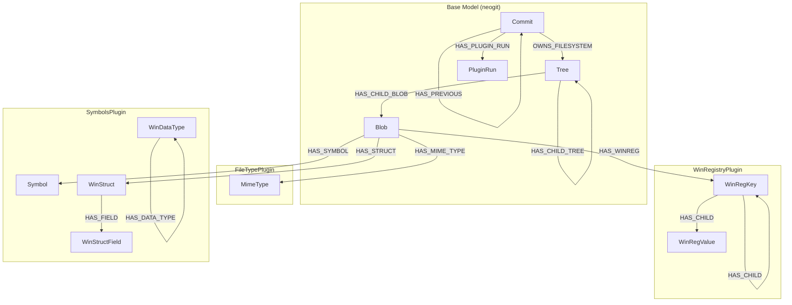
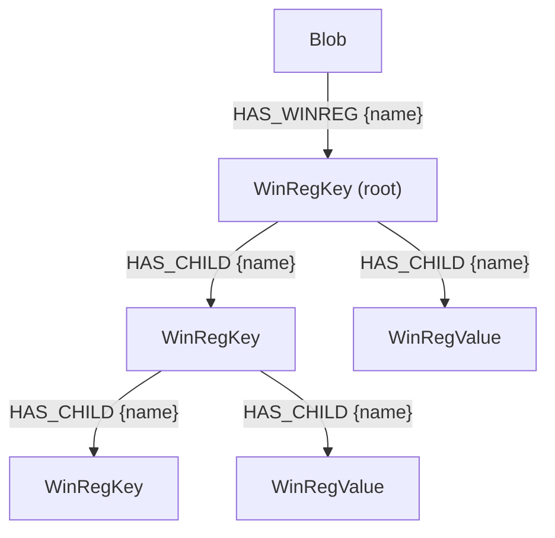
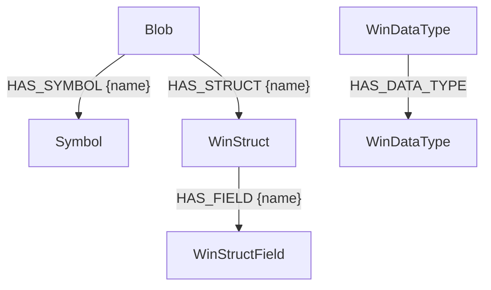
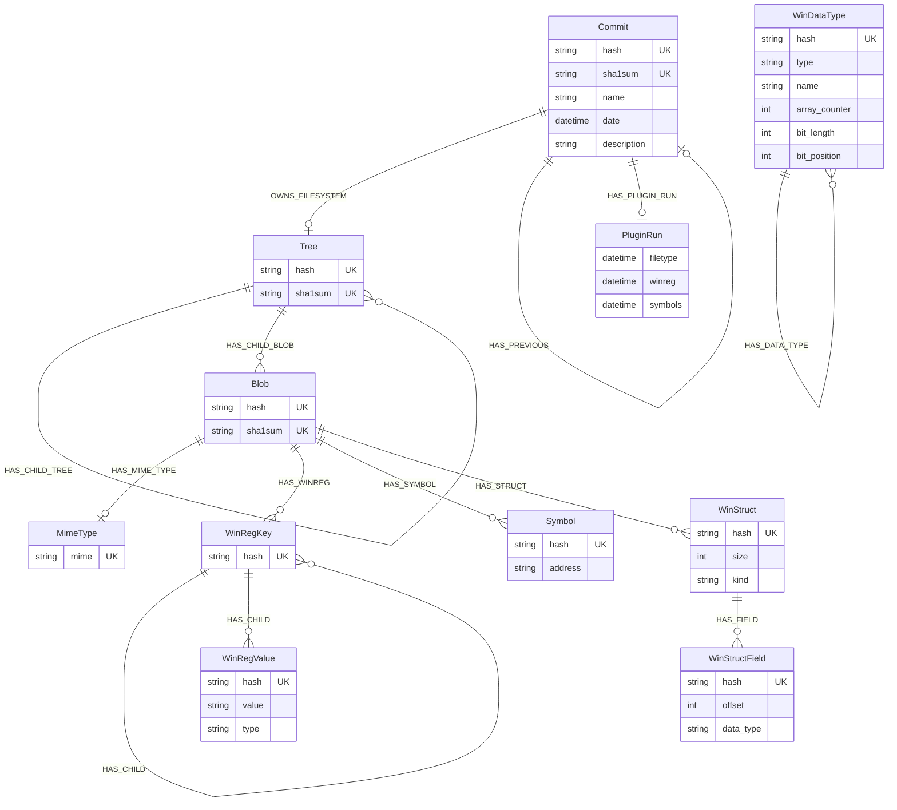

# Data Model Reference

This document describes the complete Neo4j data model used by GraphEOS Plugins, including the base model from neogit and all plugin-specific extensions.

## Overview

---

## Base Model (neogit)

The base data model is provided by the [neogit](https://github.com/OSWatcher/neogit) library and represents a versioned filesystem stored in Neo4j.

### Commit

Represents a point-in-time snapshot of the filesystem.

| Property | Type | Description |
|----------|------|-------------|
| `hash` | string | Unique identifier (content hash) |
| `sha1sum` | string | SHA1 checksum |
| `name` | string | Commit name/label |
| `date` | datetime | Commit timestamp |
| `description` | string | Optional description |

**Relationships:**

| Relationship | Target | Properties | Description |
|--------------|--------|------------|-------------|
| `OWNS_FILESYSTEM` | Tree | - | Points to root filesystem tree |
| `HAS_PREVIOUS` | Commit | - | Links to parent commit (history chain) |
| `HAS_PLUGIN_RUN` | PluginRun | - | Tracks plugin execution status |

### Tree

Represents a directory in the filesystem (Merkle tree node).

| Property | Type | Description |
|----------|------|-------------|
| `hash` | string | Unique Merkle hash |
| `sha1sum` | string | SHA1 checksum |

**Relationships:**

| Relationship | Target | Properties | Description |
|--------------|--------|------------|-------------|
| `HAS_CHILD_TREE` | Tree | `name` (string) | Child directory |
| `HAS_CHILD_BLOB` | Blob | `name` (string) | Child file |

### Blob

Represents a file in the filesystem (Merkle tree leaf).

| Property | Type | Description |
|----------|------|-------------|
| `hash` | string | Unique content hash |
| `sha1sum` | string | SHA1 checksum |

**Relationships:**

Blobs are the attachment point for all plugin-generated data. See plugin sections below.

### PluginRun

Tracks when plugins have been executed on a commit.

| Property | Type | Description |
|----------|------|-------------|
| `filetype` | datetime | When FileTypePlugin last ran |
| `winreg` | datetime | When WinRegistryPlugin last ran |
| `symbols` | datetime | When SymbolsPlugin last ran |

---

## FileTypePlugin

Identifies MIME types for all files in the filesystem.

### MimeType

| Property | Type | Constraints | Description |
|----------|------|-------------|-------------|
| `mime` | string | UNIQUE | MIME type identifier |

**Example values:** `application/pdf`, `application/vnd.microsoft.portable-executable`, `text/plain`

**Relationships:**

| Relationship | Source | Properties | Description |
|--------------|--------|------------|-------------|
| `HAS_MIME_TYPE` | Blob | - | Links file to its detected MIME type |

---

## WinRegistryPlugin

Parses Windows Registry hive files and creates a hierarchical representation of keys and values.

### WinRegKey

Represents a Windows Registry key.

| Property | Type | Constraints | Description |
|----------|------|-------------|-------------|
| `hash` | string | UNIQUE | Merkle hash of key and all descendants |

### WinRegValue

Represents a Windows Registry value.

| Property | Type | Constraints | Description |
|----------|------|-------------|-------------|
| `hash` | string | UNIQUE | Hash computed from name, value, and type |
| `value` | string | - | The value data (stored as string for 64-bit compatibility) |
| `type` | string | - | Registry value type (REG_SZ, REG_DWORD, REG_QWORD, etc.) |

### Relationships

| Relationship | Source | Target | Properties | Description |
|--------------|--------|--------|------------|-------------|
| `HAS_WINREG` | Blob | WinRegKey | `name` (string) | Connects hive file to root key |
| `HAS_CHILD` | WinRegKey | WinRegKey \| WinRegValue | `name` (string) | Parent-child hierarchy |

### Hive File Mapping

The plugin processes hive files at these Windows paths:

| Windows Path | Registry Root |
|--------------|---------------|
| `/Windows/System32/config/SAM` | `HKEY_LOCAL_MACHINE\SAM` |
| `/Windows/System32/config/SECURITY` | `HKEY_LOCAL_MACHINE\SECURITY` |
| `/Windows/System32/config/SOFTWARE` | `HKEY_LOCAL_MACHINE\SOFTWARE` |
| `/Windows/System32/config/SYSTEM` | `HKEY_LOCAL_MACHINE\SYSTEM` |
| `/Windows/System32/config/DEFAULT` | `HKEY_USERS\.Default` |
| `/boot/BCD` or `/EFI/Microsoft/Boot/BCD` | `HKEY_LOCAL_MACHINE\BCD00000000` |

---

## SymbolsPlugin

Extracts debugging symbols and type information from Windows PE files by parsing their associated PDB files.

### Symbol

Represents a symbol (function, variable) from a PE file.

| Property | Type | Constraints | Description |
|----------|------|-------------|-------------|
| `hash` | string | UNIQUE | SHA1 hash of the address |
| `address` | string | - | Memory address (stored as string for 64-bit precision) |

### WinStruct

Represents a Windows structure, union, or enum definition.

| Property | Type | Constraints | Description |
|----------|------|-------------|-------------|
| `hash` | string | UNIQUE | Merkle hash of the type definition |
| `size` | integer | - | Size in bytes |
| `kind` | string | - | Type kind: `Struct`, `Union`, or `Enum` |

### WinStructField

Represents a field within a struct or union.

| Property | Type | Constraints | Description |
|----------|------|-------------|-------------|
| `hash` | string | UNIQUE | Merkle hash of the field |
| `offset` | integer | - | Byte offset within parent struct |
| `data_type` | string | - | JSON-encoded type information |

### WinDataType

Represents a data type (used for complex/nested types).

| Property | Type | Constraints | Description |
|----------|------|-------------|-------------|
| `hash` | string | UNIQUE | Merkle hash of the type |
| `type` | string | - | Kind: `Base`, `Pointer`, `Function`, `Enum`, `Array`, `Struct`, `Union`, `Bitfield` |
| `name` | string | optional | Type name (for Base, Enum, Struct, Union) |
| `array_counter` | integer | optional | Element count (for Array types) |
| `bit_length` | integer | optional | Bit length (for Bitfield types) |
| `bit_position` | integer | optional | Bit position (for Bitfield types) |

### Relationships

| Relationship | Source | Target | Properties | Description |
|--------------|--------|--------|------------|-------------|
| `HAS_SYMBOL` | Blob | Symbol | `name` (string) | Links PE file to symbol |
| `HAS_STRUCT` | Blob | WinStruct | `name` (string) | Links PE file to type definition |
| `HAS_FIELD` | WinStruct | WinStructField | `name` (string) | Links struct to its fields |
| `HAS_DATA_TYPE` | WinDataType | WinDataType | - | Links composite types to subtypes |

### Supported PE Files

Currently processes these files (when detected as PE MIME type):
- `ntoskrnl.exe`
- `ntdll.dll`
- `kernel32.dll`

---

## Complete Entity-Relationship Diagram

---

## Constraints

All unique constraints are created automatically by each plugin via the `constraints_data()` method:

| Label | Property | Created By |
|-------|----------|------------|
| `MimeType` | `mime` | FileTypePlugin |
| `WinRegKey` | `hash` | WinRegistryPlugin |
| `WinRegValue` | `hash` | WinRegistryPlugin |
| `Symbol` | `hash` | SymbolsPlugin |
| `WinStruct` | `hash` | SymbolsPlugin |
| `WinStructField` | `hash` | SymbolsPlugin |
| `WinDataType` | `hash` | SymbolsPlugin |
