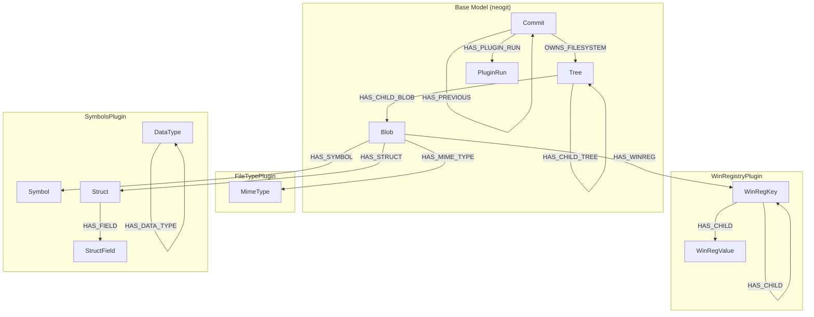
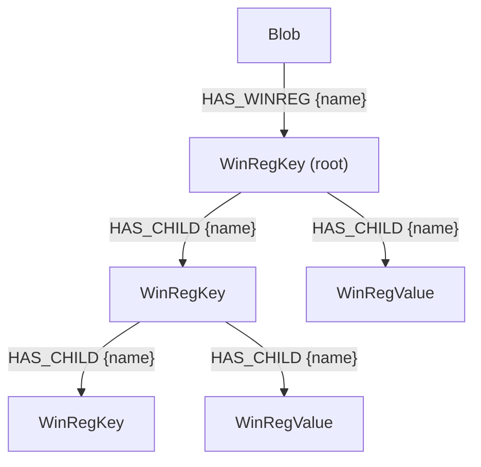
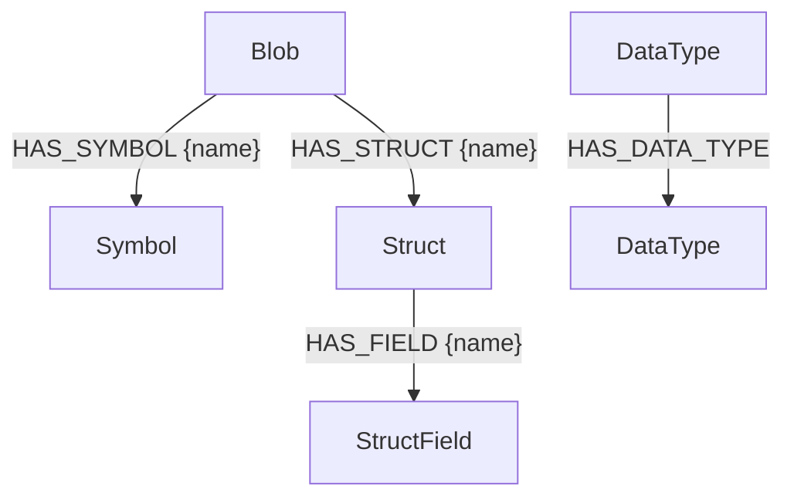

# Data Model Reference

This document describes the complete Neo4j data model used by GraphEOS Plugins, including the base model from neogit and all plugin-specific extensions.

## Overview



---

## Base Model (neogit)

The base data model is provided by the [neogit](https://github.com/OSWatcher/neogit) library and represents a versioned filesystem stored in Neo4j.

### Commit

Represents a point-in-time snapshot of the filesystem.

| Property | Type | Description |
|----------|------|-------------|
| `hash` | string | Unique identifier (content hash) |
| `sha1sum` | string | SHA1 checksum |
| `name` | string | Commit name/label |
| `date` | datetime | Commit timestamp |
| `description` | string | Optional description |

**Relationships:**

| Relationship | Target | Properties | Description |
|--------------|--------|------------|-------------|
| `OWNS_FILESYSTEM` | Tree | - | Points to root filesystem tree |
| `HAS_PREVIOUS` | Commit | - | Links to parent commit (history chain) |
| `HAS_PLUGIN_RUN` | PluginRun | - | Tracks plugin execution status |

### Tree

Represents a directory in the filesystem (Merkle tree node).

| Property | Type | Description |
|----------|------|-------------|
| `hash` | string | Unique Merkle hash |
| `sha1sum` | string | SHA1 checksum |

**Relationships:**

| Relationship | Target | Properties | Description |
|--------------|--------|------------|-------------|
| `HAS_CHILD_TREE` | Tree | `name` (string) | Child directory |
| `HAS_CHILD_BLOB` | Blob | `name` (string) | Child file |

### Blob

Represents a file in the filesystem (Merkle tree leaf).

| Property | Type | Description |
|----------|------|-------------|
| `hash` | string | Unique content hash |
| `sha1sum` | string | SHA1 checksum |

**Relationships:**

Blobs are the attachment point for all plugin-generated data. See plugin sections below.

### PluginRun

Tracks when plugins have been executed on a commit.

| Property | Type | Description |
|----------|------|-------------|
| `filetype` | datetime | When FileTypePlugin last ran |
| `winreg` | datetime | When WinRegistryPlugin last ran |
| `symbols` | datetime | When SymbolsPlugin last ran |

---

## FileTypePlugin

Identifies MIME types for all files in the filesystem.


### MimeType

| Property | Type | Constraints | Description |
|----------|------|-------------|-------------|
| `mime` | string | UNIQUE | MIME type identifier |

**Example values:** `application/pdf`, `application/vnd.microsoft.portable-executable`, `text/plain`

**Relationships:**

| Relationship | Source | Properties | Description |
|--------------|--------|------------|-------------|
| `HAS_MIME_TYPE` | Blob | - | Links file to its detected MIME type |

---

## WinRegistryPlugin

Parses Windows Registry hive files and creates a hierarchical representation of keys and values.



### WinRegKey

Represents a Windows Registry key.

| Property | Type | Constraints | Description |
|----------|------|-------------|-------------|
| `hash` | string | UNIQUE | Merkle hash of key and all descendants |

### WinRegValue

Represents a Windows Registry value.

| Property | Type | Constraints | Description |
|----------|------|-------------|-------------|
| `hash` | string | UNIQUE | Hash computed from name, value, and type |
| `value` | string | - | The value data (stored as string for 64-bit compatibility) |
| `type` | string | - | Registry value type (REG_SZ, REG_DWORD, REG_QWORD, etc.) |

### Relationships

| Relationship | Source | Target | Properties | Description |
|--------------|--------|--------|------------|-------------|
| `HAS_WINREG` | Blob | WinRegKey | `name` (string) | Connects hive file to root key |
| `HAS_CHILD` | WinRegKey | WinRegKey \| WinRegValue | `name` (string) | Parent-child hierarchy |

### Hive File Mapping

The plugin processes hive files at these Windows paths:

| Windows Path | Registry Root |
|--------------|---------------|
| `/Windows/System32/config/SAM` | `HKEY_LOCAL_MACHINE\SAM` |
| `/Windows/System32/config/SECURITY` | `HKEY_LOCAL_MACHINE\SECURITY` |
| `/Windows/System32/config/SOFTWARE` | `HKEY_LOCAL_MACHINE\SOFTWARE` |
| `/Windows/System32/config/SYSTEM` | `HKEY_LOCAL_MACHINE\SYSTEM` |
| `/Windows/System32/config/DEFAULT` | `HKEY_USERS\.Default` |
| `/boot/BCD` or `/EFI/Microsoft/Boot/BCD` | `HKEY_LOCAL_MACHINE\BCD00000000` |

---

## SymbolsPlugin

Extracts debugging symbols and type information from Windows PE files by parsing their associated PDB files.



### Symbol

Represents a symbol (function, variable) from a PE file.

| Property | Type | Constraints | Description |
|----------|------|-------------|-------------|
| `hash` | string | UNIQUE | SHA1 hash of the address |
| `address` | string | - | Memory address (stored as string for 64-bit precision) |

### Struct

Represents a Windows structure, union, or enum definition.

| Property | Type | Constraints | Description |
|----------|------|-------------|-------------|
| `hash` | string | UNIQUE | Merkle hash of the type definition |
| `size` | integer | - | Size in bytes |
| `kind` | string | - | Type kind: `Struct`, `Union`, or `Enum` |

### StructField

Represents a field within a struct or union.

| Property | Type | Constraints | Description |
|----------|------|-------------|-------------|
| `hash` | string | UNIQUE | Merkle hash of the field |
| `offset` | integer | - | Byte offset within parent struct |
| `data_type` | string | - | JSON-encoded type information |

### DataType

Represents a data type used for complex/nested types. DataType nodes are created separately from the fields that reference them, primarily for Merkle hash computation and type deduplication.

**Important**: Type information is stored in TWO ways:
1. **In StructField.data_type**: Complete type hierarchy as JSON string (directly queryable)
2. **As DataType nodes**: Separate graph nodes with HAS_DATA_TYPE relationships (for deduplication)

Currently, there is **no direct relationship** between StructField nodes and DataType nodes. See [Type Storage Architecture](#type-storage-architecture) below for details.

#### Common Properties

All DataType nodes have these properties:

| Property | Type | Constraints | Description |
|----------|------|-------------|-------------|
| `hash` | string | UNIQUE | Merkle hash of the type definition |
| `type` | string | - | Kind: `Base`, `Pointer`, `Function`, `Enum`, `Array`, `Struct`, `Union`, `Bitfield` |

Additional properties are set depending on the `type` value:

#### Properties by Type Case

##### 1. Base Types
Primitive C types like `int`, `unsigned long`, `void`, `char`, etc.

**Neo4j Properties:**
- `hash`: Merkle hash
- `type`: `"Base"`
- `name`: Type name (e.g., `"unsigned long"`, `"int"`, `"void"`)

**JSON Representation** (in StructField.data_type):
```json
{
  "kind": "Base",
  "name": "unsigned long"
}
```

**Example Node:**
```cypher
(:DataType {
  hash: "a1b2c3d4...",
  type: "Base",
  name: "unsigned long"
})
```

##### 2. Pointer Types
Pointers to other types (e.g., `void*`, `struct FOO*`).

**Neo4j Properties:**
- `hash`: Merkle hash
- `type`: `"Pointer"`

**Relationships:**
- `HAS_DATA_TYPE` → DataType (the pointed-to type)

**JSON Representation:**
```json
{
  "kind": "Pointer",
  "subtype": {
    "kind": "Base",
    "name": "void"
  }
}
```

**Example Nodes:**
```cypher
(:DataType {hash: "ptr123...", type: "Pointer"})
  -[:HAS_DATA_TYPE]->
(:DataType {hash: "base456...", type: "Base", name: "void"})
```

##### 3. Array Types
Fixed-size arrays (e.g., `int[10]`, `char[256]`).

**Neo4j Properties:**
- `hash`: Merkle hash
- `type`: `"Array"`
- `array_counter`: Number of elements (integer)

**Relationships:**
- `HAS_DATA_TYPE` → DataType (the element type)

**JSON Representation:**
```json
{
  "kind": "Array",
  "count": 10,
  "subtype": {
    "kind": "Base",
    "name": "int"
  }
}
```

**Example Nodes:**
```cypher
(:DataType {hash: "arr789...", type: "Array", array_counter: 10})
  -[:HAS_DATA_TYPE]->
(:DataType {hash: "base456...", type: "Base", name: "int"})
```

##### 4. Bitfield Types
Bitfields within structs (e.g., `unsigned int flags : 3`).

**Neo4j Properties:**
- `hash`: Merkle hash
- `type`: `"Bitfield"`
- `bit_length`: Number of bits (integer)
- `bit_position`: Starting bit position (integer)

**Relationships:**
- `HAS_DATA_TYPE` → DataType (the underlying integer type)

**JSON Representation:**
```json
{
  "kind": "Bitfield",
  "bit_length": 3,
  "bit_position": 5,
  "type": {
    "kind": "Base",
    "name": "unsigned int"
  }
}
```

**Example Nodes:**
```cypher
(:DataType {
  hash: "bit987...",
  type: "Bitfield",
  bit_length: 3,
  bit_position: 5
})
  -[:HAS_DATA_TYPE]->
(:DataType {hash: "base654...", type: "Base", name: "unsigned int"})
```

##### 5. Struct/Union/Enum References
References to user-defined types.

**Neo4j Properties:**
- `hash`: Merkle hash
- `type`: `"Struct"`, `"Union"`, or `"Enum"`
- `name`: Type name (e.g., `"_LINKED_LIST"`, `"_LARGE_INTEGER"`)

**JSON Representation:**
```json
{
  "kind": "Struct",
  "name": "_LINKED_LIST"
}
```

**Example Node:**
```cypher
(:DataType {
  hash: "struct321...",
  type: "Struct",
  name: "_LINKED_LIST"
})
```

**Note:** This references the struct definition but does NOT create a relationship to the corresponding Struct node.

##### 6. Function Types
Function pointer types.

**Neo4j Properties:**
- `hash`: Merkle hash
- `type`: `"Function"`
- `name`: `"function"` (always this value)

**JSON Representation:**
```json
{
  "kind": "Function"
}
```

**Example Node:**
```cypher
(:DataType {
  hash: "func555...",
  type: "Function",
  name: "function"
})
```

#### Type Storage Architecture

The symbols plugin uses a **hybrid storage model** for type information:

##### Storage Locations

1. **JSON in StructField.data_type**
   - **What**: Complete type hierarchy as a JSON string
   - **Where**: `StructField.data_type` property
   - **Purpose**: Efficient querying of field types without graph traversal
   - **Example**: `{"kind": "Pointer", "subtype": {"kind": "Struct", "name": "_LIST_ENTRY"}}`

2. **Separate DataType Nodes**
   - **What**: Individual graph nodes for each type
   - **Where**: Separate `:DataType` nodes in Neo4j
   - **Purpose**: Merkle hash computation and type deduplication
   - **Relationships**: `HAS_DATA_TYPE` links parent types to subtypes

##### Current Limitations

**Missing Link**: There is currently **no relationship** from `StructField` to `DataType` nodes.

This means:
- ✅ You CAN query a field's type by parsing its `data_type` JSON property
- ✅ You CAN find duplicate type definitions across the database using DataType nodes
- ❌ You CANNOT directly query "all fields that use type X" via graph traversal
- ❌ You CANNOT navigate from a field to its DataType node

##### When to Use Each Approach

| Use Case | Approach | Example |
|----------|----------|---------|
| Get type info for a specific field | Parse JSON from `StructField.data_type` | `RETURN field.data_type` |
| Find all pointer types in database | Query DataType nodes | `MATCH (d:DataType {type: "Pointer"})` |
| Find duplicate type definitions | Query DataType nodes by hash | `MATCH (d:DataType) WHERE d.hash = $hash` |
| Find fields of a given type | Parse JSON (workaround) | Use `apoc.convert.fromJsonMap()` |

#### Common Type Queries

##### Get all fields of a struct with their types

```cypher
MATCH (s:Struct {name: "_LINKED_LIST"})-[r:HAS_FIELD]->(f:StructField)
RETURN r.name AS field_name,
       f.offset AS offset,
       f.data_type AS type_json
ORDER BY f.offset
```

##### Find all pointer types in the database

```cypher
MATCH (d:DataType {type: "Pointer"})
OPTIONAL MATCH (d)-[:HAS_DATA_TYPE]->(subtype:DataType)
RETURN d.hash,
       subtype.type AS points_to_type,
       subtype.name AS points_to_name
LIMIT 100
```

##### Find all array types and their element counts

```cypher
MATCH (d:DataType {type: "Array"})
OPTIONAL MATCH (d)-[:HAS_DATA_TYPE]->(element:DataType)
RETURN d.hash,
       d.array_counter AS size,
       element.type AS element_type,
       element.name AS element_name
ORDER BY d.array_counter DESC
LIMIT 50
```

##### Find fields containing arrays (using JSON parsing)

**Note**: Requires APOC plugin for JSON parsing.

```cypher
MATCH (s:Struct)-[r:HAS_FIELD]->(f:StructField)
WHERE f.data_type CONTAINS '"kind": "Array"'
RETURN s.name AS struct_name,
       r.name AS field_name,
       f.data_type AS type_json
LIMIT 100
```

##### Find recursive/self-referential types

```cypher
MATCH (s:Struct {name: "_LINKED_LIST"})-[:HAS_FIELD]->(f:StructField)
WHERE f.data_type CONTAINS '"name": "_LINKED_LIST"'
RETURN s.name AS struct_name,
       f.data_type AS self_referential_field
```

### Relationships

| Relationship | Source | Target | Properties | Description |
|--------------|--------|--------|------------|-------------|
| `HAS_SYMBOL` | Blob | Symbol | `name` (string) | Links PE file to symbol |
| `HAS_STRUCT` | Blob | Struct | `name` (string) | Links PE file to type definition |
| `HAS_FIELD` | Struct | StructField | `name` (string) | Links struct to its fields |
| `HAS_DATA_TYPE` | DataType | DataType | - | Links composite types to subtypes |

### Supported PE Files

Currently processes these files (when detected as PE MIME type):
- `ntoskrnl.exe`
- `ntdll.dll`
- `kernel32.dll`

---

## Complete Entity-Relationship Diagram


---

## Constraints

All unique constraints are created automatically by each plugin via the `constraints_data()` method:

| Label | Property | Created By |
|-------|----------|------------|
| `MimeType` | `mime` | FileTypePlugin |
| `WinRegKey` | `hash` | WinRegistryPlugin |
| `WinRegValue` | `hash` | WinRegistryPlugin |
| `Symbol` | `hash` | SymbolsPlugin |
| `Struct` | `hash` | SymbolsPlugin |
| `StructField` | `hash` | SymbolsPlugin |
| `DataType` | `hash` | SymbolsPlugin |
