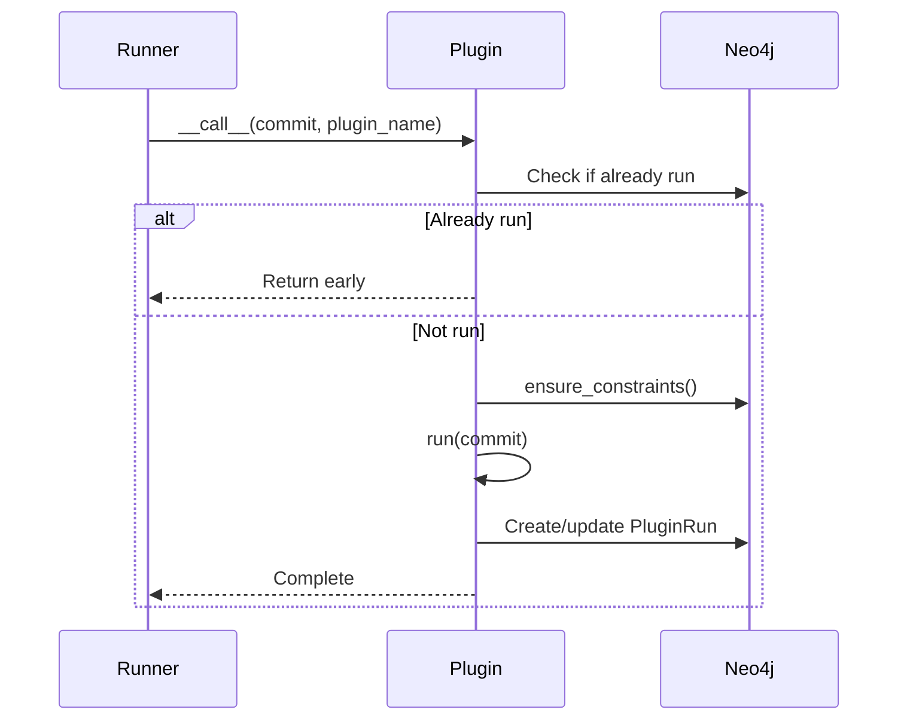

# Plugin API Reference

This document describes the API for creating plugins in OSWatcher Plugins.

## AbstractPlugin

Base class for all plugins. Located in `plugins/types.py`.

```python
from plugins.types import AbstractPlugin, UniqueConstraint
```

### Class Definition

```python
@define(auto_attribs=True)
class AbstractPlugin(BetterContextManager):
    logger: logging.Logger   # Auto-configured logger
    neogit: Neogit          # Database access
```

### Properties

#### `logger`

A pre-configured `logging.Logger` instance named `{module}.{classname}`.

```python
self.logger.info("Processing file: %s", filename)
self.logger.debug("Hash: %s", blob.hash)
```

#### `neogit`

A `Neogit` instance providing access to the Neo4j database and object storage.

**Database access:**
```python
# Execute Cypher query
results, meta = self.neogit.db.cypher_query(query, params)

# Transaction context
with self.neogit.db.transaction:
    # queries here

with self.neogit.db.write_transaction:
    # write queries here
```

**Object download:**
```python
# Stream download
for chunk in self.neogit.download_object_as_stream(blob.hash):
    file.write(chunk)
```

### Methods

#### `run(commit: Commit)` (abstract)

Main plugin logic. Must be implemented by subclasses.

**Parameters:**
- `commit`: The `Commit` node to process

**Example:**
```python
def run(self, commit: Commit):
    fs = commit.filesystem.single()
    for path, blob in fs.all_blobs():
        self.process_blob(blob)
```

#### `constraints_data() -> List[UniqueConstraint]`

Returns unique constraints to create before running.

**Returns:** List of `UniqueConstraint` objects

**Example:**
```python
def constraints_data(self) -> List[UniqueConstraint]:
    return [
        UniqueConstraint(label="MyNode", property_list=["hash"]),
        UniqueConstraint(label="MyNode", property_list=["name", "version"]),
    ]
```

#### `downloaded_file(hash: str)` (context manager)

Downloads a blob to a temporary file.

**Parameters:**
- `hash`: Blob hash to download

**Yields:** Path to temporary file (deleted on exit)

**Example:**
```python
with self.downloaded_file(blob.hash) as local_path:
    data = open(local_path, 'rb').read()
    # process data
# file is automatically deleted
```

#### `ensure_constraints()`

Called automatically before `run()`. Creates all constraints from `constraints_data()`.

---

## UniqueConstraint

Defines a unique constraint for Neo4j.

```python
from plugins.types import UniqueConstraint
```

### Definition

```python
@define(auto_attribs=True)
class UniqueConstraint:
    label: str              # Node label
    property_list: list[str]  # Properties to constrain
```

### Example

```python
# Single property constraint
UniqueConstraint(label="MimeType", property_list=["mime"])

# Generated Cypher:
# CREATE CONSTRAINT mimetype_mime_unique
# IF NOT EXISTS
# FOR (n:MimeType)
# REQUIRE n.mime IS UNIQUE
```

---

## Commit Model

The `Commit` class from neogit provides access to filesystem data.

### Key Methods

#### `filesystem.single() -> Tree`

Returns the root Tree node of the commit's filesystem.

```python
fs = commit.filesystem.single()
```

#### `plugin.all() -> List[PluginRun]`

Returns plugin run tracking nodes.

```python
plugin_runs = commit.plugin.all()
```

---

## Tree Model

The `Tree` class represents directories.

### Key Methods

#### `get_blob_at_path(path: PurePath) -> Blob`

Retrieves a blob at the specified path.

```python
from pathlib import PurePath

blob = fs.get_blob_at_path(PurePath("/Windows/System32/config/SAM"))
```

**Raises:** `FileNotFoundError` if path doesn't exist

#### `get_tree_at_path(path: PurePath) -> Tree`

Retrieves a tree (directory) at the specified path.

```python
tree = fs.get_tree_at_path(PurePath("/Windows/System32"))
```

#### `all_blobs() -> Iterator[Tuple[PurePath, Blob]]`

Iterates over all blobs in the tree recursively.

```python
for path, blob in fs.all_blobs():
    print(f"{path}: {blob.hash}")
```

#### `iter_children() -> Iterator[Tuple[str, Tree | Blob]]`

Iterates over immediate children.

```python
for name, child in tree.iter_children():
    if isinstance(child, Blob):
        print(f"File: {name}")
    else:
        print(f"Directory: {name}")
```

---

## Helper Functions

### `cypher_query_with_backoff(query, params)`

Executes a Cypher query with automatic retry on deadlock.

```python
from neogit.service.neogit import cypher_query_with_backoff

cypher_query_with_backoff(
    "MERGE (n:MyNode {hash: $hash})",
    {"hash": "abc123"}
)
```

---

## Plugin Lifecycle



1. Plugin is instantiated and called with a commit
2. Checks if plugin already ran on this commit (via `PluginRun` node)
3. Creates necessary database constraints
4. Executes `run()` method
5. Creates/updates `PluginRun` node with timestamp

---

## Complete Plugin Example

```python
from typing import List

from attrs import define
from neogit.model.neo import Commit

from plugins.types import AbstractPlugin, UniqueConstraint


@define(auto_attribs=True)
class MyPlugin(AbstractPlugin):

    def constraints_data(self) -> List[UniqueConstraint]:
        return [
            UniqueConstraint(label="MyNode", property_list=["hash"]),
        ]

    def run(self, commit: Commit):
        fs = commit.filesystem.single()

        for path, blob in fs.all_blobs():
            self.logger.debug("Processing: %s", path)

            # Download and process file
            with self.downloaded_file(blob.hash) as local_path:
                result = self.analyze(local_path)

            # Store results in Neo4j
            query = """
            MERGE (n:MyNode {hash: $hash})
            WITH n
            MATCH (b:Blob {hash: $blob_hash})
            MERGE (b)-[:HAS_ANALYSIS]->(n)
            """
            self.neogit.db.cypher_query(query, {
                "hash": result.hash,
                "blob_hash": blob.hash
            })

    def analyze(self, path):
        # Custom analysis logic
        pass
```
